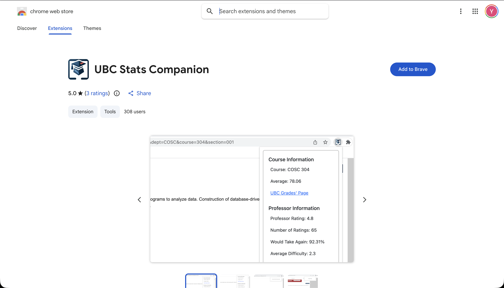
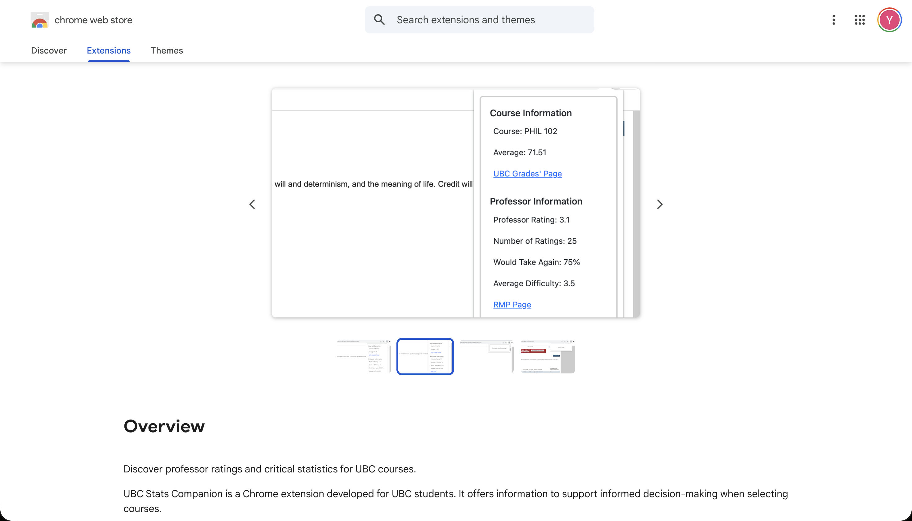
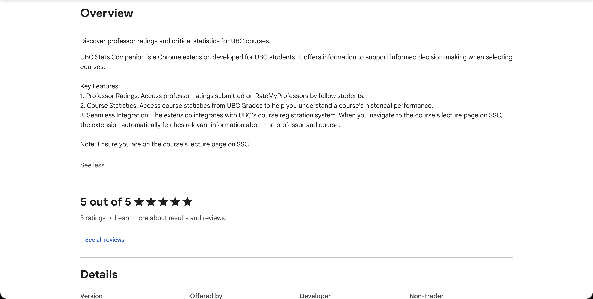
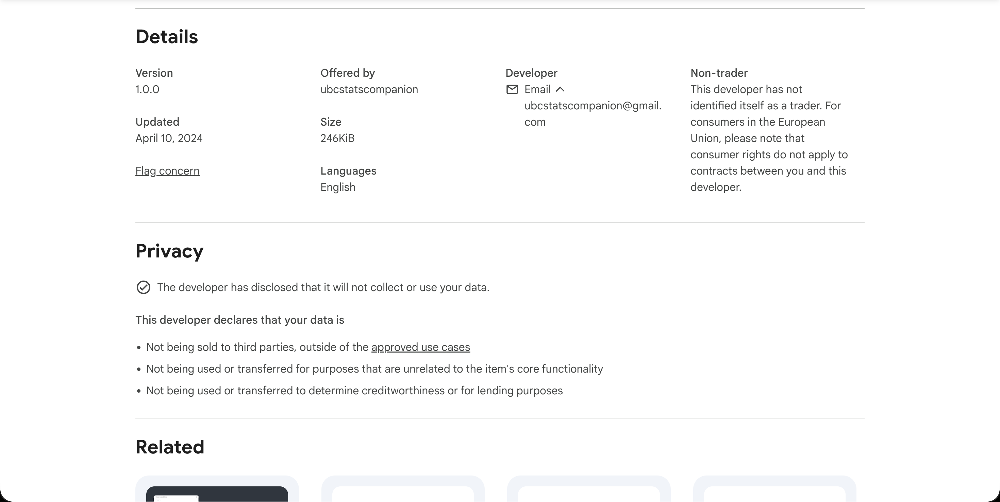

# UBC Stats Companion

UBC Stats Companion is a Chrome extension that lets UBC students access course statistics from UBC Grades and professor ratings from RateMyProfessors instantly with a simple click.

When the user clicks on the extension on a valid page, the extension fetches the course's data using UBC Grades' API. For professor statistics, web scraping is used to extract the professor's statistics from their page on RateMyProfessors.

  

  

  

  

To install the extension: [https://bit.ly/ubc-stats-companion](https://bit.ly/ubc-stats-companion)

Tech Used: HTML, CSS, JavaScript, JQuery, Bootstrap
